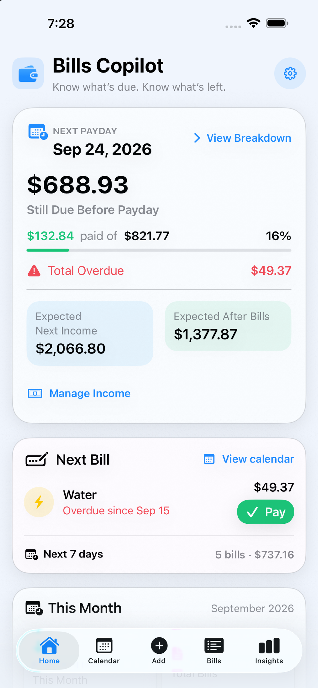
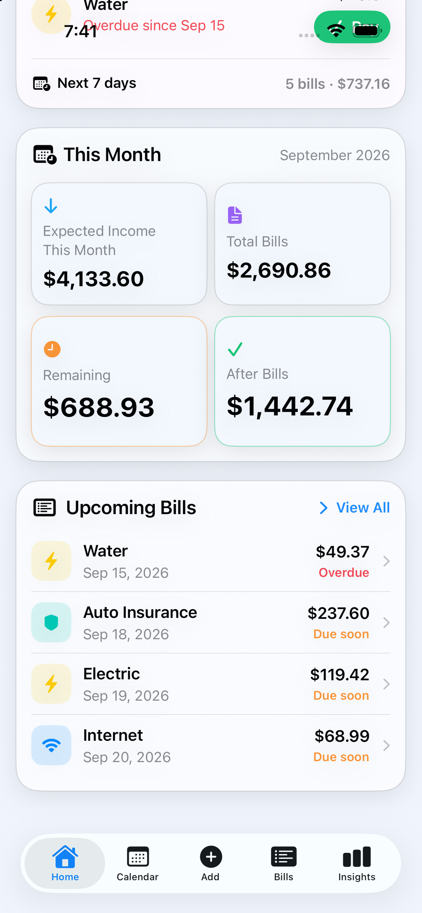
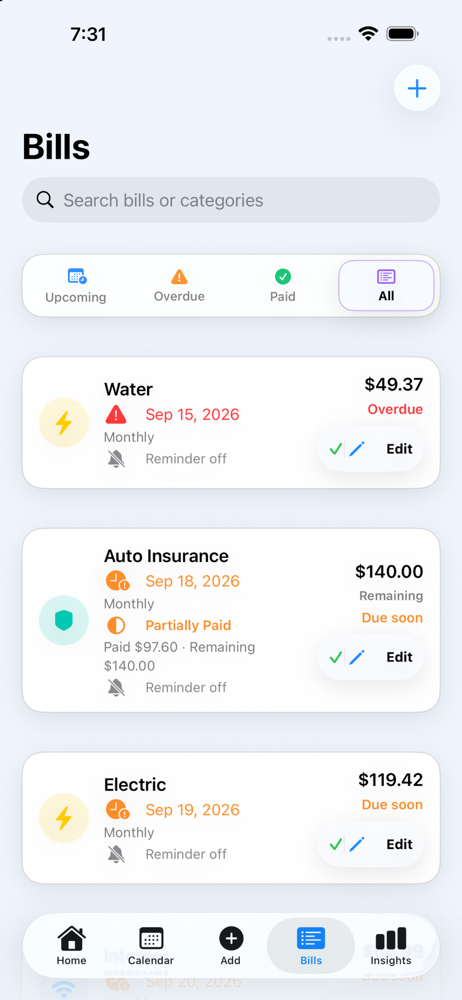
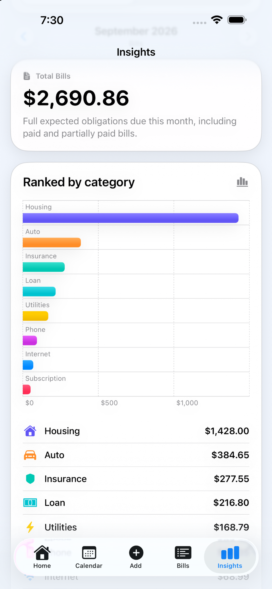

# Bills Copilot

### Engineering Case Study · Native iOS · Local-First

Bills Copilot is a native iOS app I built around a simple idea:

**Help people understand what is due, what has already been paid, and what remains before the next paycheck — without requiring a bank connection.**

This repository is a public engineering case study. The production source code and internal engineering documentation remain private.

---

## Product Preview

<p align="center">
  
  
  
  
</p>

---

## The Problem

Many personal-finance apps begin with transaction feeds or bank integrations.

Bills Copilot takes a different approach. It focuses on planning around recurring obligations:

- What bills are coming up?
- What has already been paid?
- What still needs attention?
- What remains before the next paycheck?

That product boundary kept the app focused while creating deeper engineering challenges around recurrence, payment history, persistence, migrations, and financial-domain semantics.

---

## The Journey

The first versions of Bills Copilot focused on shipping a useful product:

- recurring bills and due dates
- local reminders
- payment history
- bill calendar
- monthly insights
- user-controlled backup and export

As the product evolved, I realized that adding features was no longer the hardest part.

**Preserving the meaning and integrity of existing user data was.**

Before expanding the product further, I audited the repository and began treating the persistence layer and financial rules as long-term contracts rather than implementation details.

That changed how I approached the project.

---

## Engineering Evolution

Bills Copilot started with a pragmatic SwiftUI + SwiftData architecture and gradually evolved toward more explicit domain boundaries, migration rules, and regression protection.

Areas I worked through include:

- SwiftData schema evolution and migrations
- recurring financial obligations
- payment history and partial payments
- expected vs. recorded values
- pay schedules and paycheck occurrences
- payday planning
- local notifications
- backup compatibility
- currency isolation
- preservation of historical data meaning
- automated regression testing

The project now uses explicit schema evolution across multiple versions, with migration behavior treated as part of the product rather than an afterthought.

---

## Core Technologies

- Swift
- SwiftUI
- SwiftData
- Observation
- UserNotifications
- Charts
- Swift Concurrency
- XCTest

The app intentionally favors native Apple frameworks and a local-first design.

---

## Domain Modeling

One of the biggest lessons from the project was that values that look similar in the UI are not necessarily the same thing in the domain.

For example:

```text
Expected bill amount
        ≠
Bank transaction

Recorded payment
        ≠
Bank verification

Autopay configuration
        ≠
Proof that payment occurred

Expected paycheck
        ≠
Money actually received
```

Keeping those distinctions explicit helped prevent the data model from making claims the app could not actually prove.

---

## Partial Payments

Bills Copilot supports multiple payment records against the same obligation.

```text
Expected obligation:  $800

Payment 1:             $125
Payment 2:             $300

Applied:               $425
Remaining:             $375
```

Planning calculations operate on the remaining obligation instead of reducing payment state to a simple paid/unpaid flag.

---

## Payday Planning

The product later expanded from calendar-month tracking into pay-period planning.

```text
Next Paycheck
     ↓
Bills in Pay Period
     ↓
Already Paid
     ↓
Still Due
     ↓
Earlier Overdue
     ↓
Remaining Commitments
     ↓
Expected After Commitments
```

The goal is not to represent a bank balance. It is to provide a planning view of upcoming obligations.

---

## Persistence & Migration

Shipping the app changed the way I thought about persistence.

Once real users may already have stored data, schema changes are no longer just code changes.

The project evolved toward:

- explicit schema versions
- migration coverage
- backward-compatible backup behavior
- non-destructive data rules
- preservation of historical uncertainty
- regression tests around persisted financial behavior

One of the most important lessons from this work:

> Adding a feature is easier than preserving what existing user data already means.

---

## Testing Growth

Testing became more important as the domain logic grew.

```text
Early audited baseline:   40 tests

Current baseline:        267 tests
Passed:                  267
Failed:                    0
Skipped:                   0
```

The test suite grew alongside the product and covers areas such as persistence, migrations, recurring obligations, payment allocation, payday calculations, income handling, backup behavior, and domain invariants.

For me, that progression represents the biggest change in the project:

**from building screens to protecting behavior.**

---

## Privacy Philosophy

Bills Copilot was designed around a local-first model.

The app does not require a bank connection to organize bills. Financial records are modeled locally, and exports are initiated by the user.

I also learned to keep privacy claims precise rather than absolute — especially when a real app interacts with operating-system services, backups, notifications, and user-controlled exports.

---

## What This Project Taught Me

Bills Copilot has been one of my most valuable software-engineering projects because it moved beyond simply making features work.

It taught me that:

- shipping changes how you must think about migrations
- data semantics matter as much as data structures
- edge cases become product requirements
- automated tests become more valuable as business logic grows
- architecture should evolve because of real problems, not trends
- preserving uncertainty is often better than inventing certainty
- production software requires thinking beyond the current version

Most importantly:

**Software engineering is not only about making something work today. It is about making sure tomorrow's version still respects what yesterday's version meant.**

---

## Product

Bills Copilot is available on the App Store.

- [App Store](https://apps.apple.com/us/app/bills-copilot/id6795343743)
- [Product Page](https://truenorth242.com/apps/bills-copilot)

---

## About This Repository

This repository documents selected engineering decisions and lessons from Bills Copilot.

It intentionally does **not** include:

- production source code
- internal engineering audits
- private implementation details
- credentials or secrets
- internal defect tracking

The goal is to document the engineering journey without exposing the commercial codebase.

---

## Developer

**Gabriel Sanchez**  
iOS Developer · Software Engineer · Indie Product Builder

- [TrueNorth242](https://truenorth242.com)
- [GitHub Profile](https://github.com/VW602)
